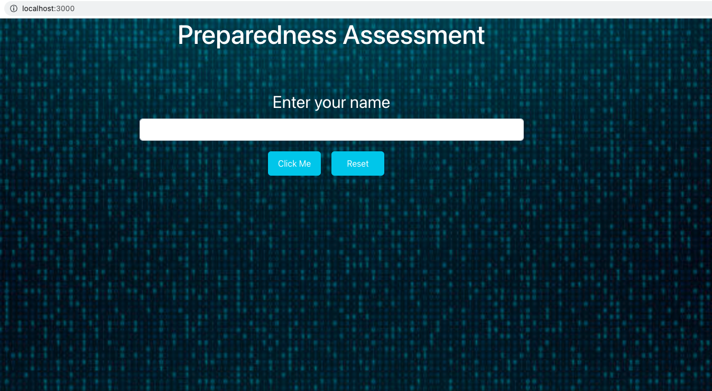
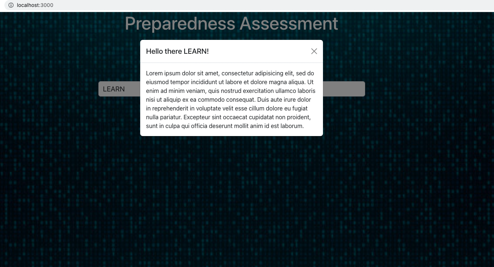

# ⭐️ Preparedness Assessment

The goal of this assessment is to provide you a platform to explore concepts that will be covered in your preparedness interviews. The assessment doesn't have a due date and will not be submitted to the instruction team. Completion of the assessment is not required. Like all things at LEARN, you will get out of this assessment what you choose to put in.

There are two portions of the assessment: frontend and backend. The frontend is a React application called `preparedness-frontend` that is nested in this repository. The backend portion is using data visualization tool to explore relationships between database models.

## Frontend Assessment

The frontend assessment is a React application with some basic code to define a structure of the application.

- `cd` into the `preparedness-frontend` directory
- Install the dependencies by running `yarn`
- [Reactstrap Modal](https://reactstrap.github.io/?path=/docs/components-modal--modal)

### Frontend Functionality Acceptance Criteria

- [X] ~~*The application has a title of `Preparedness Assessment`*~~ [2023-06-10]
- [X] ~~*The application has an input field*~~ [2023-06-10]
- [X] ~~*The input field has a label that says `Enter your name`*~~ [2023-06-10]
- [X] ~~*Below the input field there are two buttons*~~ [2023-06-10]
- [X] ~~*The first button says `Click Me`*~~ [2023-06-10]
- [X] ~~*The second button says `Reset`*~~ [2023-06-10]
- [X] ~~*The user can enter their name in the input field*~~ [2023-06-10]
- [X] ~~*When the `Click Me` button is selected a modal appears*~~ [2023-06-10]



- [X] ~~*The modal has a header that greets the user with their name*~~ [2023-06-10]
- [X] ~~*The modal has a body with lorem ipsum filler text*~~ [2023-06-10]



- The `Reset` button clears the input field

### Frontend Styling Acceptance Criteria

- The header text color is white and is 50px
- The header is centered on the page
- The input label text color is white and is 35px
- The input label is centered on the page
- The input field text is 18px
- The input field should take up 50% of the width of the page
- The input field is centered on the page
- There is 12px of padding on the left and the right of the input field
- There is 6px of padding on the top and the bottom of the input field
- The background is this [image](./preparedness-frontend/src/assets/background-image.jpeg)
- The buttons are centered under the input field
- The background color of the buttons are `#0dcaf0`
- The color of the text on the buttons is white
- The is 10 px of padding on all sides of the button
- There is 20px between the two buttons
- There is 20px between the bottom of the input and the top of the buttons

---

## Backend Assessment

Prompt: What is the relationship between a model called `person`, a model called `house`, and a model called `car`? (Hint: there is more than one right answer!)

- Go to [dbdiagram](https://dbdiagram.io/) and create a free personal account
- Start a new diagram
- Enter the following code into the left side bar to create the base structure for three models
- A free account will allow you to create 10 diagrams so explore different options

```sql
Table person {
  id integer
  created_at timestamp
  updated_at timestamp
}

Table car {
  id integer
  created_at timestamp
  updated_at timestamp
}

Table house {
  id integer
  created_at timestamp
  updated_at timestamp
}
```

- Add foreign keys to create relationships between models
- Use the following example from the syllabus section for creating relationships between a model called `owner` and a model called `credit_card`
- The foreign key and the `ref` will create a visual connection between models

```sql
Table owner {
  id integer
  created_at timestamp
  updated_at timestamp
}

Table credit_cards {
  id integer
  owner_id integer [ref: > owner.id]
  created_at timestamp
  updated_at timestamp
}
```
